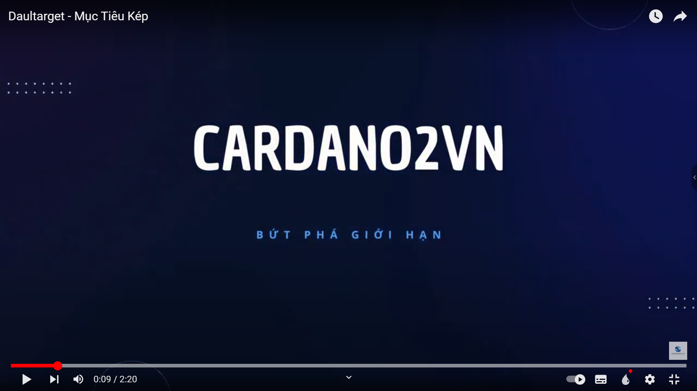

<div align="center">
  <h2>A Decentralized Automated Trading Bot for ADA Holders</h2>
  <p><strong>Staking & Asset Growth Solution</strong></p>
  
</div>

<div align="center">
  
[](https://github.com/independenceee/dualtarget)
[](https://opensource.org/licenses/MIT)
[](https://nextjs.org/)
[](https://golang.org/)

</div>

---

## 🎯 Project Overview

Dualtarget is an innovative decentralized automated trading bot specifically designed for Cardano (ADA) holders. This platform bridges the gap between traditional staking and modern automated trading, allowing users to grow their cryptocurrency assets passively while maintaining full control through decentralized mechanisms.

### Why Dualtarget?

- **For Stakers**: Earn additional returns on your ADA holdings through intelligent algorithmic trading
- **For Traders**: Access a decentralized trading infrastructure with minimal fees and maximum transparency
- **For Developers**: Build upon a robust, open-source blockchain infrastructure with clean APIs
- **For the Community**: Support a fully decentralized, community-driven trading ecosystem

The platform combines cutting-edge blockchain technology with sophisticated trading strategies to provide a seamless experience for managing and growing digital assets.

**Watch the Demo Video:**

[](https://www.youtube.com/watch?v=DCWY93O_QAU&t=1s "Dualtarget Demo - Everything Is AWESOME")

---

## ✨ Key Features

### 🎰 Staking Integration

- Earn competitive rewards by staking ADA through integrated pools
- Real-time stake pool performance monitoring
- Automatic reward collection and compounding
- Support for multiple delegation strategies

### 🤖 Automated Trading

- AI-powered trading algorithms optimized for Cardano ecosystem
- Support for DEX trading through Minswap SDK
- Real-time market data from multiple sources (Blockfrost, Koios)
- Backtesting and strategy simulation tools

### 💼 Asset Management

- Multi-wallet support with seamless integration
- Portfolio tracking and performance analytics
- Transaction history and detailed reporting
- Secure wallet connections (Chrome extensions)

### 🌐 Multi-Network Support

- Mainnet (Production) - Full production trading environment
- Preprod (Testnet) - Safe testing ground for new features
- Easy network switching within the application

### 🔒 Security & Trust

- Smart contract auditable architecture
- Non-custodial design - you always control your private keys
- Transparent transaction validation on-chain
- Integration with trusted blockchain APIs

### 🌍 Internationalization

- Multi-language support (Vietnamese, English, and more)
- Localized content and documentation
- Region-specific configurations

---

## 🛠️ Technology Stack

### Frontend Architecture

- **Framework**: [Next.js 14.1.0](https://nextjs.org/) - React-based production-ready framework
- **Language**: TypeScript - For type-safe development
- **Styling**: SCSS/CSS - Modern, modular styling approach
- **State Management**: React Context API - Global state handling
- **Wallet Integration**: Support for major Cardano wallet extensions

### Backend Services

- **Language**: Go - High-performance, concurrent processing
- **API Layer**: RESTful architecture with clean endpoints
- **Database**: PostgreSQL - Reliable data persistence
- **Docker**: Containerized deployment and scaling

### Blockchain Integration

- **Blockfrost API**: Primary blockchain data provider
- **Koios API**: Backup blockchain data source
- **Minswap SDK**: DEX protocol integration
- **Cardano**: Native blockchain network

### Additional Tools

- **Git**: Version control and collaboration
- **Docker Compose**: Multi-container orchestration
- **npm/Node.js**: Package management

---

## 📁 Project Structure

### Directory Overview

```
dualtarget/
├── frontend/                 # Next.js React Application
│   ├── src/
│   │   ├── app/             # Next.js App Router (pages and routes)
│   │   ├── assets/          # Images, icons, fonts
│   │   ├── components/      # Reusable React components
│   │   ├── configs/         # Configuration files
│   │   ├── constants/       # Static constant values
│   │   ├── contexts/        # Global state management
│   │   ├── data/            # Static data (FAQs, guides)
│   │   ├── helpers/         # Utility helper functions
│   │   ├── hooks/           # Custom React hooks
│   │   ├── layouts/         # Layout components
│   │   ├── libs/            # Third-party integrations
│   │   ├── services/        # API services
│   │   ├── styles/          # Global styles
│   │   ├── translations/    # i18n translation files
│   │   └── types/           # TypeScript type definitions
│   ├── public/              # Static assets
│   ├── Dockerfile           # Container configuration
│   ├── docker-compose.yml   # Docker Compose setup
│   ├── next.config.mjs      # Next.js configuration
│   ├── tsconfig.json        # TypeScript configuration
│   └── package.json         # Dependencies
│
├── backend/                 # Go REST API
│   ├── src/
│   │   ├── main.go          # Entry point
│   │   ├── api/             # External API integrations
│   │   ├── configs/         # Configuration management
│   │   ├── constants/       # Constants and enums
│   │   ├── controllers/     # API request handlers
│   │   ├── data/            # Data structures
│   │   ├── dto/             # Data transfer objects
│   │   ├── helpers/         # Utility functions
│   │   ├── models/          # Database models
│   │   ├── repository/      # Database access layer
│   │   ├── routers/         # Route definitions
│   │   ├── services/        # Business logic
│   │   └── utils/           # General utilities
│   ├── Dockerfile           # Container configuration
│   ├── docker-compose.yml   # Docker Compose setup
│   ├── go.mod               # Go module definition
│   └── go.sum               # Dependency checksums
│
└── database/                # Database setup and migrations
    └── docker-compose.yml   # Database container configuration
```

### Frontend Directory Details

| Directory      | Purpose                                   | Contains                                                |
| -------------- | ----------------------------------------- | ------------------------------------------------------- |
| `app`          | Route management using Next.js App Router | Page components, layout components, route definitions   |
| `assets`       | Static project resources                  | PNG/SVG images, icon fonts, custom fonts, brand assets  |
| `components`   | Reusable UI components                    | Button, Input, Modal, Card, Chart, Table, etc.          |
| `configs`      | Application configuration                 | Route definitions, wallet configurations, API endpoints |
| `constants`    | Static application data                   | Environment names, wallet lists, network info, headers  |
| `contexts`     | Global state management                   | User context, wallet context, theme context             |
| `data`         | Static content                            | FAQ items, guide content, founder information           |
| `helpers`      | Utility functions                         | Network validation, date conversion, data formatting    |
| `hooks`        | Custom React hooks                        | useWallet, useCopy, useLocalStorage, custom logic hooks |
| `layouts`      | Layout components                         | Header, Footer, Sidebar, navigation structures          |
| `libs`         | Third-party integrations                  | SDK initialization, external library wrappers           |
| `services`     | API integration layer                     | Blockfrost service, Koios service, transaction service  |
| `styles`       | Global styling                            | Global CSS/SCSS, variables, mixins, theme definitions   |
| `translations` | i18n files                                | Translation JSON for multiple languages                 |
| `types`        | TypeScript types                          | Custom type definitions, interfaces, enums              |

### Key Configuration Files

- **`wallets.ts`** - Configuration for supported Cardano wallets (Eternl, Nami, etc.)
- **`routes.ts`** - Application route definitions and navigation structure
- **`networks.ts`** - Network configuration (Mainnet, Preprod, custom RPC endpoints)

### Backend Directory Details

The Go backend provides RESTful APIs for:

- **Account Management** - User profile, authentication, account settings
- **Transaction Processing** - Transaction creation, validation, and monitoring
- **Mail Services** - Notifications and email communications
- **Blockchain Integration** - Communication with Cardano network

---

## 🚀 Quick Start

Get up and running in just 5 minutes!

### Prerequisites Checklist

Before starting, ensure you have:

```bash
# Check Git installation
git --version

# Check Node.js installation (v16 or higher)
node --version
npm --version

# Optional: Check Docker installation
docker --version
```

### 1. Clone the Repository

```bash
# Clone the repository from GitHub
git clone https://github.com/independenceee/dualtarget.git

# Navigate to the frontend directory
cd dualtarget/frontend

# (Optional) Check the available branches
git branch -a
```

### 2. Set Up Environment Variables

Create or update `next.config.mjs` with your blockchain API keys:

1. **Get Blockfrost API Key**:
   - Visit [blockfrost.io](https://blockfrost.io)
   - Sign up for a free account
   - Create a new project
   - Copy your API key for Mainnet and/or Preprod

2. **Get Koios API Key** (Optional):
   - Visit [koios.rest](https://www.koios.rest)
   - Review documentation
   - Use the public API endpoint or get your own

3. **Configure `next.config.mjs`**:

```typescript
const nextConfig = {
  env: {
    // ===== MAINNET CONFIGURATION =====
    BLOCKFROST_NETWORK_NAME_MAINNET: "Mainnet",
    BLOCKFROST_RPC_URL_MAINNET: "https://cardano-mainnet.blockfrost.io/api/v0",
    BLOCKFROST_PROJECT_API_KEY_MAINNET: "YOUR_BLOCKFROST_MAINNET_KEY",
    KOIOS_RPC_URL_MAINNET: "https://api.koios.rest/api/v1",
    NEXT_APP_BASE_URL_MAINNET: "https://api.dualtarget.vn/api/v1",
    DUALTARGET_CONTRACT_ADDRESS_MAINNET: "your_contract_address",
    DUALTARGET_PAYMENT_ADDRESS_MAINNET: "your_payment_address",
    DUALTARGET_STAKE_ADDRESS_MAINNET: "your_stake_address",
    POOL_ID_MAINNET: "pool1rqgf6qd0p3wyf9dxf2w7qcddvgg4vu56l35ez2xqemhqun2gn7y",

    // ===== PREPROD (TESTNET) CONFIGURATION =====
    BLOCKFROST_NETWORK_NAME_PREPROD: "Preprod",
    BLOCKFROST_RPC_URL_PREPROD: "https://cardano-preprod.blockfrost.io/api/v0",
    BLOCKFROST_PROJECT_API_KEY_PREPROD: "YOUR_BLOCKFROST_PREPROD_KEY",
    KOIOS_RPC_URL_PREPROD: "https://preprod.koios.rest/api/v1",
    NEXT_APP_BASE_URL_PREPROD: "https://preprod.dualtarget.vn/api/v1",
    DUALTARGET_CONTRACT_ADDRESS_PREPROD: "your_contract_address",
    DUALTARGET_PAYMENT_ADDRESS_PREPROD: "your_payment_address",
    DUALTARGET_STAKE_ADDRESS_PREPROD:
      "stake_test1uq7cj74n8ryrmg20rasqnqcygv4kwrmn2yjemkv3ux2k7lgqu950l",
    POOL_ID_PREPROD: "pool1ke9h4mggr8ttf45ale5dv4ntkvuw2wkvm6la4mv02688xuy99qp",
  },
};

export default nextConfig;
```

### 3. Choose Your Installation Method

#### 🐳 Option A: Docker (Recommended - One Command!)

**Advantages**: No local dependencies, consistent environment, easy cleanup

```bash
# Ensure Docker is running, then execute:
docker compose up --build

# The application will start automatically and be available at:
# http://localhost:3000

# To stop: Press Ctrl+C or run:
docker compose down
```

#### 📦 Option B: Node.js (More Control)

**Advantages**: Faster iteration, easier debugging, no Docker overhead

```bash
# Install project dependencies
npm install
# This downloads all required packages (may take 2-3 minutes on first run)

# Start the development server
npm run dev
# Server will start at http://localhost:3000
# Press Ctrl+C to stop the server

# Watch for file changes and auto-reload enabled
```

---

## 📦 Installation

### Step 1: Verify Prerequisites

Make sure you have all required software installed:

```bash
# Verify Git
git --version
# Should output: git version X.X.X...

# Verify Node.js (16.0.0 or higher)
node --version
npm --version
# Should output versions like v18.x.x and 9.x.x

# Verify Docker (if using Docker method)
docker --version
docker compose --version
```

### Step 2: Clone and Navigate

```bash
git clone https://github.com/independenceee/dualtarget.git
cd dualtarget/frontend
```

### Step 3: Environment Configuration

Configure your `.env.local` or `next.config.mjs` with API endpoints:

1. **Blockfrost Setup** (Primary):
   - Create account at [blockfrost.io](https://blockfrost.io)
   - Generate API keys for desired networks
   - Add to configuration

2. **Koios Setup** (Optional Backup):
   - Visit [koios.rest](https://www.koios.rest)
   - Can use public endpoints or register for custom ones

### Step 4: Run the Application

**Using Docker:**

```bash
docker compose up --build
```

**Using Node.js:**

```bash
npm install
npm run dev
```

Both will launch at `http://localhost:3000`

### Step 5: Build for Production

When ready to deploy:

```bash
# Create optimized production build
npm run build

# Test production build locally
npm run start
# Application runs at http://localhost:3000 in production mode

# Verify bundle size
npm run analyze  # If available
```

---

## 💻 Development

### Available Scripts

```bash
# Start development server with hot reload
npm run dev

# Build optimized production bundle
npm run build

# Start production server
npm run start

# Run linting checks (ESLint)
npm run lint

# Run tests (if configured)
npm run test

# Format code (Prettier)
npm run format

# Type checking
npm run type-check
```

### Development Guidelines

- **Component Structure**: Keep components small and focused (max 300 lines)
- **Naming Convention**: Use PascalCase for components, camelCase for functions
- **Styling**: Use SCSS modules for component-specific styles
- **Type Safety**: Always define TypeScript types/interfaces
- **Comments**: Document complex logic with clear comments
- **Testing**: Write unit tests for utilities and complex components

### Useful Development Resources

- [Next.js Documentation](https://nextjs.org/docs)
- [React Documentation](https://react.dev)
- [TypeScript Handbook](https://www.typescriptlang.org/docs/)
- [Tailwind CSS](https://tailwindcss.com/docs)

---

## 🔧 Configuration

### Environment Variables

#### Network Configuration

```
BLOCKFROST_NETWORK_NAME_*: Network display name
BLOCKFROST_RPC_URL_*: Blockchain API endpoint
BLOCKFROST_PROJECT_API_KEY_*: Your Blockfrost API key
```

#### Contract Addresses

```
DUALTARGET_CONTRACT_ADDRESS_*: Main contract address
DUALTARGET_PAYMENT_ADDRESS_*: Payment address
DUALTARGET_STAKE_ADDRESS_*: Staking address
```

#### API Endpoints

```
NEXT_APP_BASE_URL_*: Backend API base URL
KOIOS_RPC_URL_*: Koios blockchain API
```

### Supported Networks

1. **Mainnet (Production)**
   - Real ADA transactions
   - Live stake pools
   - Production contracts

2. **Preprod (Testnet)**
   - Free test ADA (from faucet)
   - Development/testing only
   - Safe for experimentation

### Wallet Configuration

Edit `configs/wallets.ts` to add/modify supported wallet extensions:

```typescript
export const WALLET_EXTENSIONS = {
  eternl: { name: "Eternl", extension: "..." },
  nami: { name: "Nami", extension: "..." },
  // Add more wallets as needed
};
```

---

## 📚 API Documentation

### Backend API Endpoints

#### Account Endpoints

- `POST /api/v1/accounts/register` - Create new account
- `POST /api/v1/accounts/login` - User authentication
- `GET /api/v1/accounts/{id}` - Get account details
- `PUT /api/v1/accounts/{id}` - Update account info

#### Transaction Endpoints

- `POST /api/v1/transactions/create` - Create transaction
- `GET /api/v1/transactions/{id}` - Get transaction details
- `GET /api/v1/transactions` - List user transactions
- `POST /api/v1/transactions/{id}/sign` - Sign transaction

#### Staking Endpoints

- `GET /api/v1/staking/pools` - List available pools
- `POST /api/v1/staking/delegate` - Delegate to pool
- `GET /api/v1/staking/rewards` - Get staking rewards
- `GET /api/v1/staking/status` - Check delegation status

#### Mail Endpoints

- `POST /api/v1/mail/send` - Send email notification
- `POST /api/v1/mail/subscribe` - Subscribe to notifications

### Response Format

All API responses follow this standard format:

```json
{
  "status": "success|error",
  "data": {
    /* response payload */
  },
  "message": "Human readable message",
  "timestamp": "2024-01-01T00:00:00Z"
}
```

---

## 🐛 Troubleshooting

### Common Issues & Solutions

#### Port 3000 Already in Use

```bash
# On Windows
netstat -ano | findstr :3000
taskkill /PID <PID> /F

# On macOS/Linux
lsof -ti:3000 | xargs kill -9
```

#### Node Modules Issues

```bash
# Clear npm cache
npm cache clean --force

# Remove node_modules and package-lock
rm -rf node_modules package-lock.json

# Reinstall
npm install
```

#### Docker Issues

```bash
# Remove containers and rebuild
docker compose down -v
docker compose up --build

# Check logs
docker compose logs -f
```

#### API Connection Errors

- Verify API keys in `next.config.mjs`
- Check network selection (Mainnet vs Preprod)
- Ensure backend API is running
- Check firewall/VPN settings

#### Wallet Connection Issues

- Clear browser cache and cookies
- Disable browser extensions temporarily
- Try different Cardano wallet extension
- Check wallet is unlocked and connected to correct network

### Debug Mode

Enable detailed logging:

```typescript
// In your component
const DEBUG = process.env.NODE_ENV === "development";

if (DEBUG) {
  console.log("Debug information...");
}
```

### Getting Help

1. Check [GitHub Issues](https://github.com/independenceee/dualtarget/issues)
2. Review documentation
3. Contact support (see below)
4. Submit detailed bug report with:
   - Error message
   - Steps to reproduce
   - Browser/OS information
   - Network (Mainnet/Preprod)

---

## 📄 License

This project is released under the [MIT License](./LICENSE).

```
MIT License

Permission is hereby granted, free of charge, to any person obtaining a copy
of this software and associated documentation files (the "Software"), to deal
in the Software without restriction, including without limitation the rights
to use, copy, modify, merge, publish, distribute, sublicense, and/or sell
copies of the Software...

See LICENSE file for full text.
```

---

## 💬 Contact & Support

### Get in Touch

- **Email**: [nguyenkhanh17112003@gmail.com](mailto:nguyenkhanh17112003@gmail.com)
- **GitHub**: [independenceee/dualtarget](https://github.com/independenceee/dualtarget)
- **Issues**: [GitHub Issues](https://github.com/independenceee/dualtarget/issues)
- **Discussions**: [GitHub Discussions](https://github.com/independenceee/dualtarget/discussions)

### Community

- Follow us on GitHub for updates
- Check GitHub Discussions for community topics
- Report bugs with detailed information
- Share feature requests and suggestions

### Contributing

We welcome contributions! Please:

1. Fork the repository
2. Create a feature branch (`git checkout -b feature/amazing-feature`)
3. Commit your changes (`git commit -m 'Add amazing feature'`)
4. Push to the branch (`git push origin feature/amazing-feature`)
5. Open a Pull Request

### Support Channels

- 📖 **Documentation**: Check the README and code comments
- 🐛 **Bug Reports**: Use GitHub Issues
- 💬 **General Questions**: Use GitHub Discussions
- 📧 **Direct Contact**: Email the maintainer

---

<div align="center">
  <p><strong>Made with ❤️ for the Cardano Community</strong></p>
  <p>
    <a href="https://cardano.org">Cardano</a> •
    <a href="https://www.minswap.exchange">Minswap</a> •
    <a href="https://blockfrost.io">Blockfrost</a> •
    <a href="https://www.koios.rest">Koios</a>
  </p>
</div>
